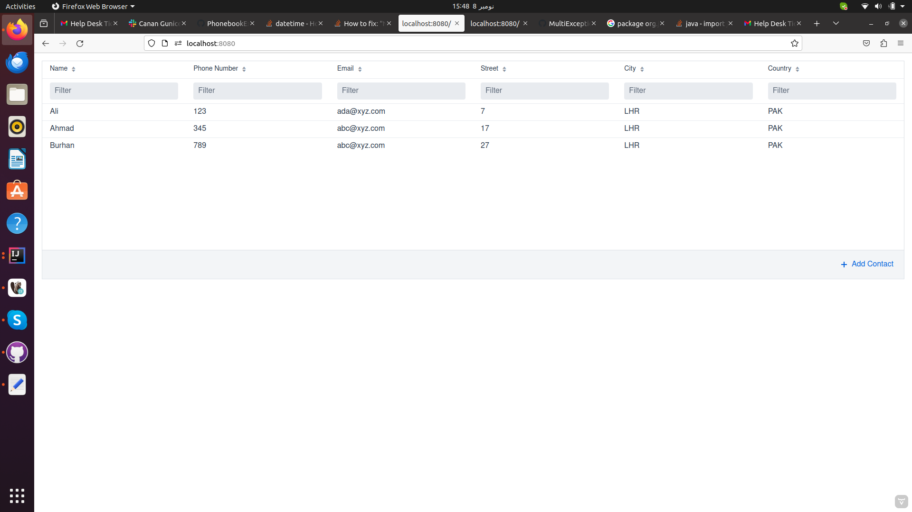
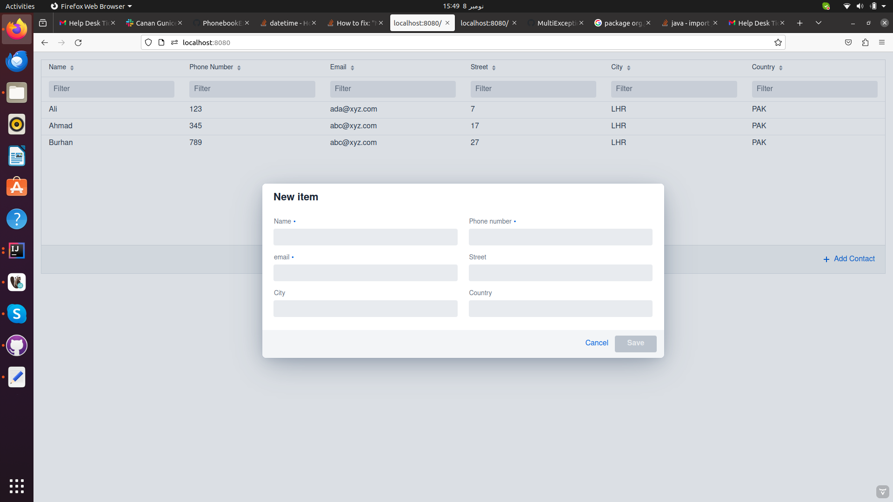
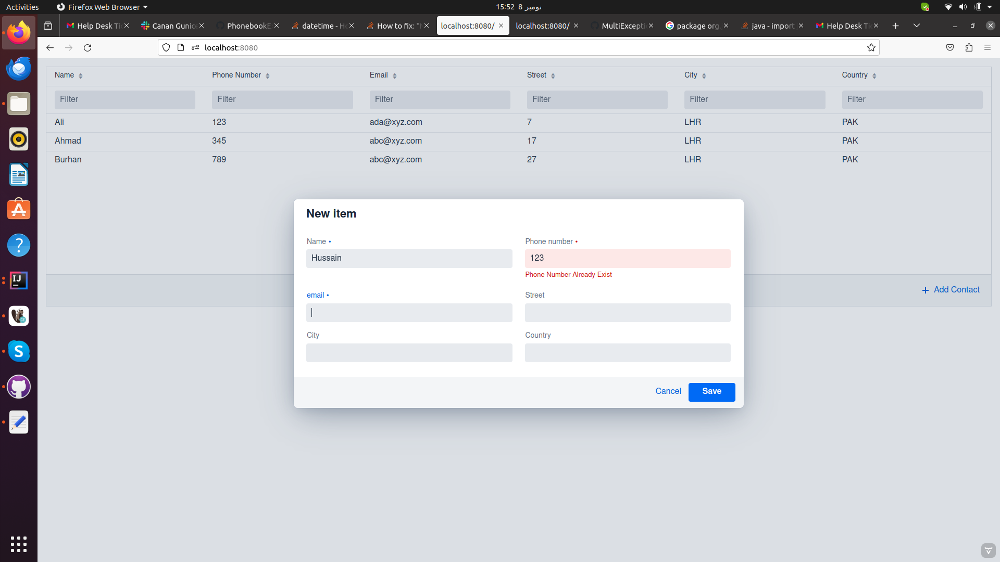
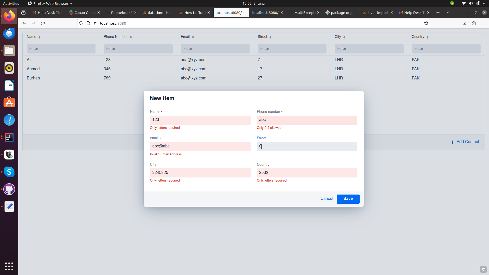
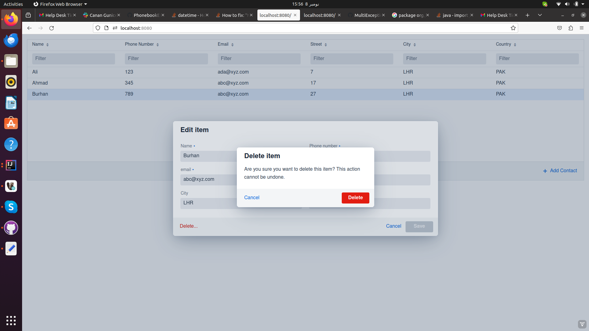
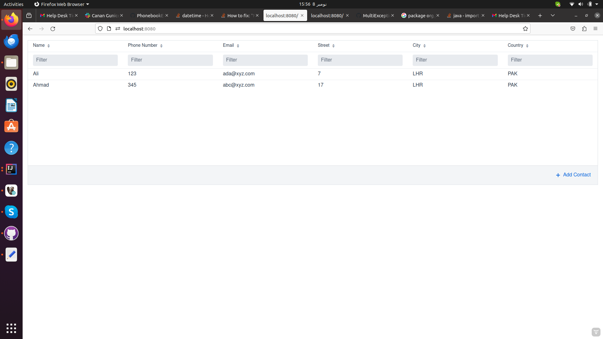
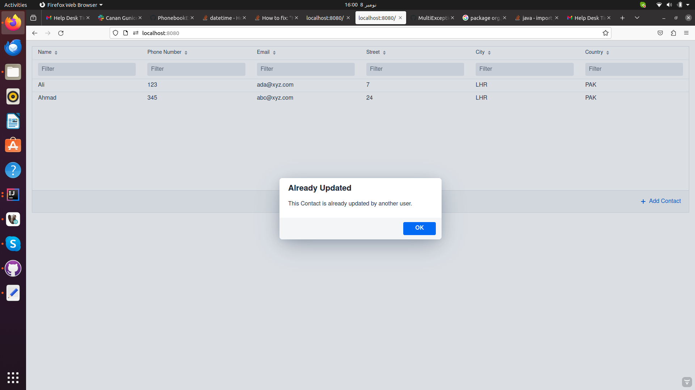

# Prerequisite Steps to setup project locally

- Download and install IntelliJ
- Download and install Java 17.
- Download and install mysql database.
- Set you paths and run the project.

# Few screen shots of project screens and with applied validations
 - First load screen fetching data from database.
   

 - Add new record screen
   

 - Screen with unique phone number validation
   

 - Screen with basic form validations
   

 - Screen For Delete Verification
   

 - After deletion the record has been deleted
   

 - Screen with updated notification record.
   